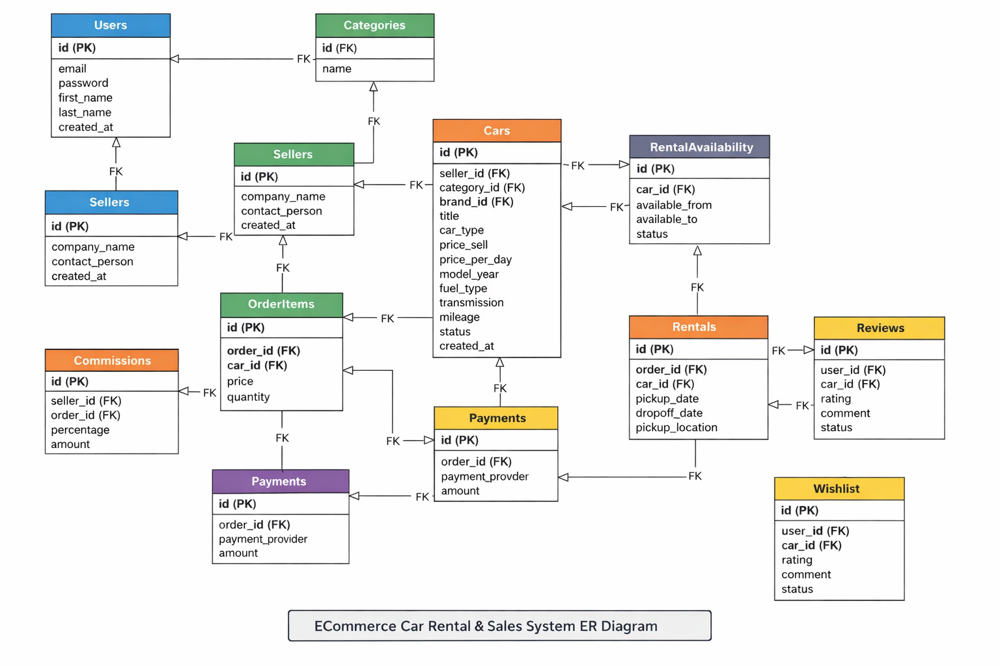

## CarRental and Buy Ecommerce Website
--------------------------------------------
This is multivendor ecommerce website. Customers can purchase web scripts in various technologies.

# Features
--------------------------------------------
- Website
    - Home Page
        - Header
        - Search Bar (Car Name, Brand, Category, Location)
        - Latest Products
        - Featured Listings (Admin/Seller Promoted cars)
        - Rental vs Buy Toggle
        - Popular Categories (According to Rented & Bought count)
        - Popular Brands (According to their Popularity and Year)
        - Most Selled (According to Selled Products)
        - Location Based Availability (for rentals)
        - Range Filter (Price, Color, Brand, Consumption, Engine Type)
        - Customer Rating and Reviews
        - Footer
    - All Category List
    - All Product List According to category
        - Filter according to price, rental/buy, brand, model year, Fuel Type, Transmission, Mileage, Availability status
        - Sort according to price, latest, alphabet, views, rating, most ranted/selled
    - Product Detail
        - Rental availability Calender
        - Multiple videos and images
        - Seller Profile info
        - Similar Cars
        - Insurance Details
        - Terms and Conditions
        - Refund / Cancellation Policy
        - Customer Rating and Reviews
    - Checkout Page
        - PayPal
        - RazorPay
        - Stripe
        - Coupon / Promo Cod
        - Tax Calculation
        - Delivery / Pickup options
        - Invoice Generation(PDF)
        - Booking Summary (For Rental)
    - Order Success Page
    - Order Failure Page
    - Multilingual
--------------------------------------------
- Customer Panel
    - Login
    - Register
    - Forgot Password
    - Dashboard
        - Orders
        - Profile
        - Change Password
    - Wishlist / Favorites
    - Saved Addresses
    - Saved Payment Methods
    - Booking History (Rental vs Purchase)
    - Download Invoices
    - Review Moderation (Edit/Delete own reviews)
    - Cancel/Return request
--------------------------------------------
- Seller Panel
    - Login
    - Register
    - Forgot Password
    - Dashboard
        - Manage Categories
        - Manage Products
        - Orders
        - Customers
        - Profile
        - Change Password
    - Rental availability management
    - Pricing rules (daily / weekly / monthly)
    - Upload car documents (RC, insurance)
    - Earnings & payouts
    - Sales & rental analytics
    - Chat with customers (optional but powerful)
--------------------------------------------
- Admin Panel
    - Manage Sellers
    - Manage Categories
    - Manage Products
    - Manage Customers
    - Manage Orders
    - Dashboard analytics (revenue, rentals, sales)
    - Commission management
    - Payment settlement
    - Dispute management
    - Review moderation
    - CMS (Home banners, static pages)
    - Multilingual
    - Role & permission management
    - Audit logs
--------------------------------------------
- Multilingual
    - Language switcher
    - RTL support (if needed later)
    - Translation management (Admin side)
    - Currency conversion
--------------------------------------------
- Security and System Features
    - Email verification
    - Phone OTP (for rentals)
    - CAPTCHA
    - Rate limiting
    - JWT / OAuth authentication
    - Role-based access control (RBAC)
    - Secure file uploads
    - Activity logs

# Database Design
--------------------------------------------
- Users App
    - Users (Users Authentication Table)
        - id (PK)
        - role ENUM('customer','seller','admin')
        - first_name
        - last_name
        - email UNIQUE
        - gender
        - phone
        - password
        - email_verified
        - status ENUM('active','blocked')
        - created_at
        - updated_at
    - Saved Addresses (Customer Specific Tables)
        - id (PK)
        - user (FK)
        - address_type ENUM('billing','shipping')
        - full_name
        - phone
        - country
        - state
        - city
        - street_address
        - postal_code
        - is_default BOOLEAN
        - created_at
        - updated_at
    - Payment Methods (Tooken Only)
        - id (PK)
        - user (FK)
        - provider ENUM('stripe','paypal','razorpay')
        - payment_token
        - card_brand
        - last4
        - expiry_month
        - expiry_year
        - is_default BOOLEAN
        - created_at
        - updated_at
    - Reviews
        - id (PK)
        - user (FK -> user.id)
        - car (FK -> car.id)
        - rating (1–5)
        - comment
        - status ENUM('approved','pending','rejected')
        - created_at
    - Wishlists
        - id (PK)
        - user_id (FK -> user.id)
        - car (FK -> car.id)
        - created_at
- Sellers App
    - Sellers
        - id (PK)
        - user (FK -> users.id)
        - company_name
        - business_email (Unique)
        - business_phone
        - verification_status ENUM('pending','approved','rejected')
        - created_at
        - updated_at
    - Commissions
        - id (PK)
        - seller (FK -> sellers.id)
        - order (FK -> order.id)
        - percentage
        - amount
        - paid
        - paid_at
        - created_at
    - Audit Logs
        - id (PK)
        - user (FK -> users.id)
        - user_agent
        - action
        - ip_address
        - created_at
- Cars App
    - Categories
        - id (PK)
        - name
        - category_slug
        - parent (nullable)
        - status ENUM('active','inactive')
        - created_at
        - updated_at
    - Brands
        - id (PK)
        - name (Unique)
        - country
        - slug
        - founded_year
        - status
        - created_at
        - updated_at
    - Cars (Products) (Rent only, Sell only, Both)
        - id (PK)
        - seller (FK -> sellers.id)
        - category (FK -> categories.id)
        - brand (FK -> brands.id)
        - title
        - slug
        - description
        - car_type ENUM('rent','sell','both')
        - price_sell
        - price_per_day
        - model_year
        - fuel_type ENUM('petrol', 'diesel', 'electric', 'Hybrid')
        - transmission ENUM('manual', 'automatic')
        - mileage
        - status ENUM('active','inactive','sold')
        - views_count
        - is_available
        - created_at
        - updated_at
    - Rental Availability (Prevents double booking & Enables calander view)
        - id (PK)
        - car (FK -> cars.id)
        - available_from
        - available_to
        - status ENUM('available','booked','blocked')
        - created_at
    - Rentals (Only for Rent orders)
        - id (PK)
        - order (FK -> orders.id)
        - car (FK -> cars.id)
        - pickup_date
        - dropoff_date
        - pickup_location
        - dropoff_location
        - total_days
        - created_at
- Orders app
    - Orders (Master Table - Snapshot address)
        - id (PK)
        - order_number
        - user_ (FK -> users.id)
        - seller (FK -> sellers.id)
        - order_type ENUM('rent','sell')
        - payment_status ENUM('pending','paid','cancelled','completed')
        - total_amount
        - payment_provider
        - billing_address_json
        - quatity
        - payment_reference
        - paid_at
        - cancelled_at
        - completed_at
    - Order Items
        - id (PK)
        - order (FK -> orders.id)
        - car (FK -> cars.id)
        - price_snapshot
        - quantity
        - rental_start_date
        - rental_end_date
        - created_at
    - Payments
        - id (PK)
        - order (FK -> orders.id)
        - payment_provider ENUM('stripe', 'razorpay', 'paypal')
        - transaction_id
        - amount
        - currency ENUM('usd', 'eur', 'gbp')
        - status ENUM('initiated', 'successful', 'failed', 'refunded')
        - paid_at
        - initialized_at
        - completed_at
--------------------------------------------

# API Development
--------------------------------------------
- REST API
- Secure Authentication
- Admin, Seller, Customer APIs

# UI/UX
--------------------------------------------
- Page wireframes
- Dashboard layout
- Mobile-first design
- Performance optimization

# Technologies (2025)
--------------------------------------------
- Programming:-------- python 3.12.0
- Backend Framework:-- Django 5.2.8
- Frontend Framework:- ReactJS
- CSS Framework:------ BootStrap
- Database:----------- PostgreSQL
- Payment:------------ Stripe, RazorPay, PayPal
- Authentication:----- JWT + OAuth